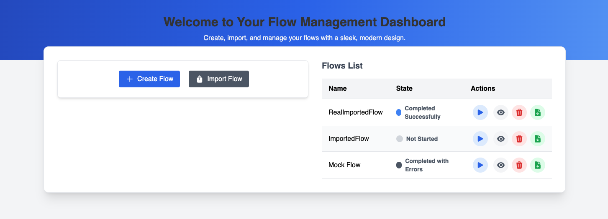
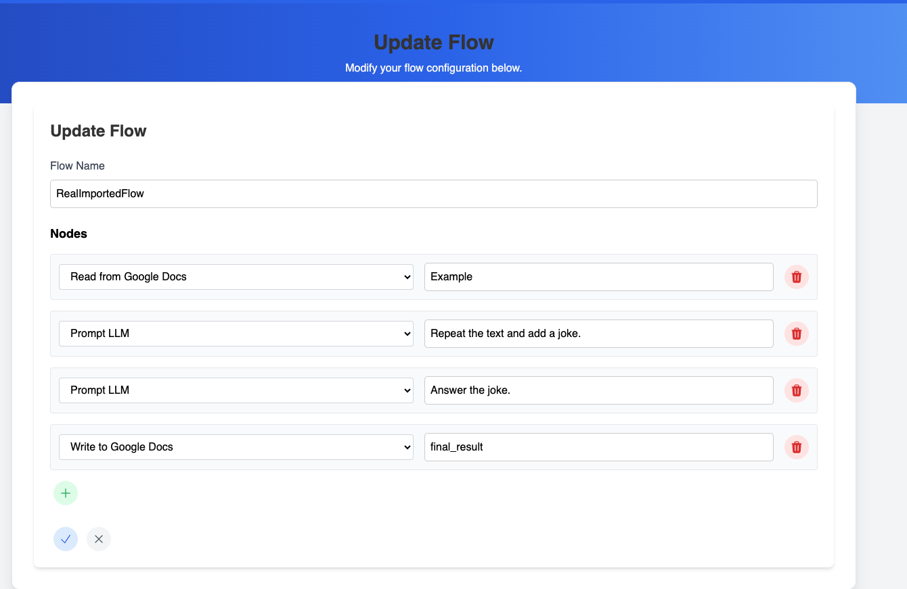

# Project Documentation 🚀

## Data Model 📊

Upon reading the challenge, the first thing that immediately became clear to me was the data model. I knew that I would have to have a **Flow** object as well as a **Node** object and support having multiple Nodes as part of a Flow. Eventually the data model evolved alongside the application, and I ended up adding states for the Flow, which for once allows the user to:

- See the current state of the flow
- See the last result of it

## Database 🗄️

I ended up going for **Postgres**, after doing my initial development with SQLite. Postgres scales better and even if the load is small in this limited context, I thought it better to already go with a more capable database.

Looking back, I started with Relational databases and stuck to them till the end since I thought that the relational aspect of them would prove beneficial for future advanced queries, but eventually using a Document database would have probably been better since it would match much better the UI model.

## Backend App 🔧

I went with **FastAPI** and **SQLAlchemy** as an ORM. FastAPI for me is just the fastest way to set up a python web application. SQLAlchemy provided me a much needed interface for working with Postgres.

The application includes:

- CRUD functionality
- Run flow component
  - Authenticates to Google Docs and Drive services
  - Processes node by node
  - Different actions depending on node type
  - Tracks data processed in each node

For the **LLM action**, I decided to use **Langchain** to really ease the process, and for reading from Google Docs, I decided that it would be good if the user could just write the name of the file and the app would find it using the Google Drive API.

## Frontend App 💻

Regarding the frontend app, it was a really fun and interesting experience, since I never had much contact with JavaScript. I honestly spent too much time here, but I'm also glad for the learning experience.

### Main Page Structure



1. **Create and Import Panel**
   - Flow creation
   - Flow importing
2. **Flow List Panel**
   - Edit flow
   - Run flow
   - Delete flow
   - Export flow

When users click the edit flow button, they are redirected to a dedicated edit page where they can:

- Modify any flow properties
- Add new nodes to the flow
- Remove existing nodes
- Update node configurations



## Suggested Improvements 🚀

### User Authentication 🔐

- Implement secure user authentication system
- Add role-based access control
- Enable sharing flows between users
- Track user activity and flow ownership

### Flow Control Enhancements ⚙️

- Add ability to pause running flows
- Implement flow restart functionality
- Add flow execution history
- Real-time flow status monitoring (percentage of execution)

### Extended Actions Support 🔧

- Support for different types of actions beyond current implementation
- Potential new actions could include:
  - Email integration
  - Database operations
  - File system operations
  - API integrations
  - Custom script execution

Here’s the formatted section to maintain consistency with the rest of the document:

---

## Orchestration 🎮

To run the project, follow these steps:

1. **Start the application using Docker Compose**
   Run the following command in your terminal:

   ```bash
   docker compose up -d
   ```

   Once the application is running, navigate to **localhost:8000**, where the UI is exposed.

2. **Enable Google Authentication (Optional)**
   To enable Google authentication, you need to generate your token before running the project. Follow these steps:

   - Navigate to the backend source directory:
     ```bash
     cd backend/src
     ```
   - Create a local virtual environment using Poetry:
     ```bash
     poetry install
     ```
   - Activate the virtual environment:
     ```bash
     poetry shell
     ```
   - Generate the Google authentication token:
     ```bash
     python google_auth/generate_token.py
     ```
   - Follow the prompts to allow permissions for accessing Google Drive and Google Docs.
   - Once permissions are granted, a `token.json` file will be created under the `google_auth` folder.
